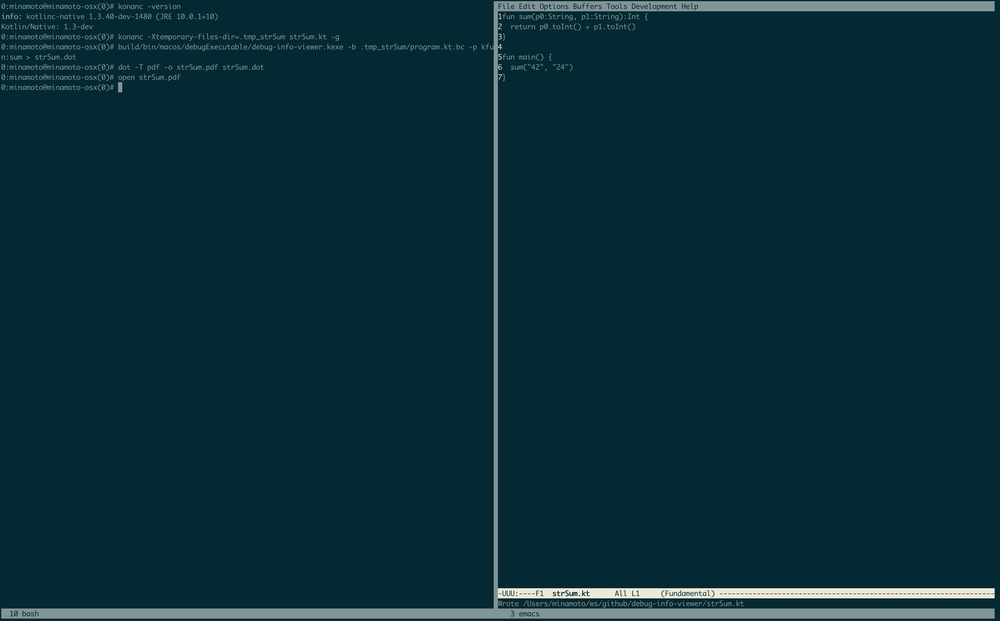
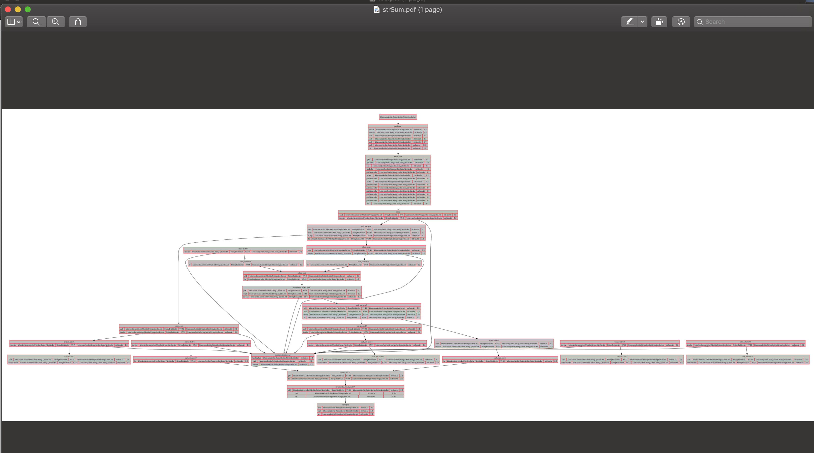
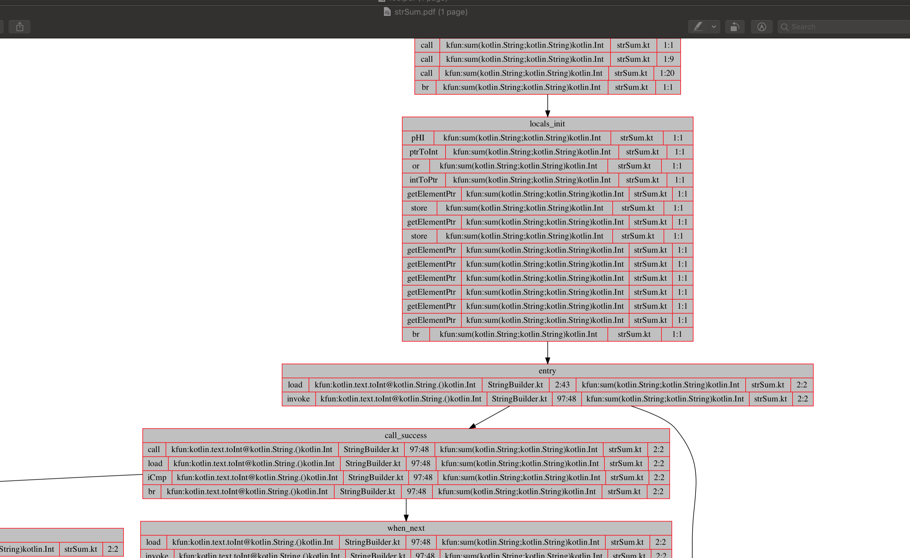

1. ##### Dependencies.
   1. kotlin native 
   1. llvm 6+ _(macports curently)_
1. ###### Build.

   ````
   # ./gradlew build
   ````

1. How to use?
   ````
   0:minamoto@minamoto-osx(0)# konanc -version                                                                           
   info: kotlinc-native 1.3.40-dev-1480 (JRE 10.0.1+10)
   Kotlin/Native: 1.3-dev
   0:minamoto@minamoto-osx(0)# konanc -Xtemporary-files-dir=.tmp_strSum strSum.kt -g
   0:minamoto@minamoto-osx(0)# build/bin/macos/debugExecutable/debug-info-viewer.kexe -b .tmp_strSum/program.kt.bc -p kfun:sum > strSum.dot
   0:minamoto@minamoto-osx(0)# dot -T pdf -o strSum.pdf strSum.dot
   0:minamoto@minamoto-osx(0)# open strSum.pdf                                                      
   ````
 in pictures :) :
 
 
 